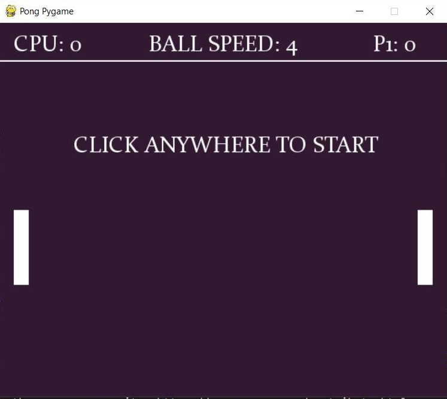
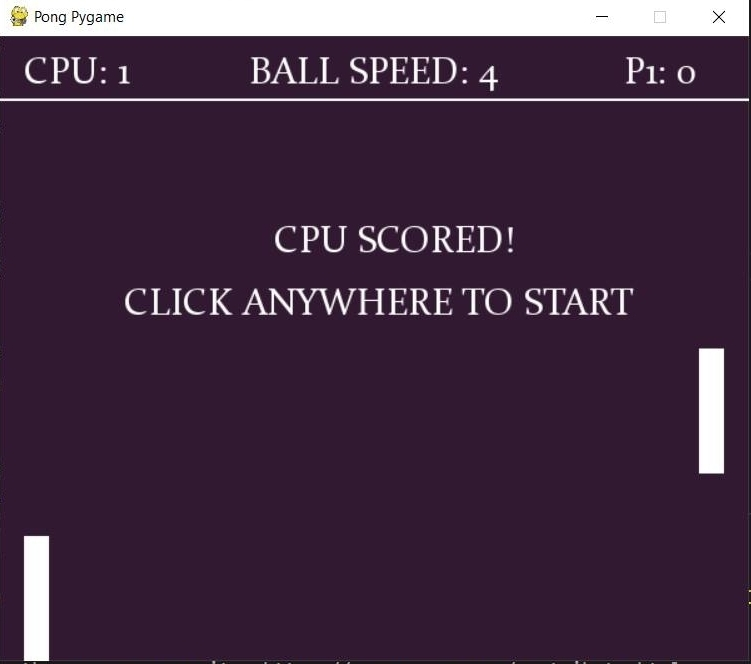

# Pong Pygame
 
# About
This project is essentially a pong game.

The player plays pong with a computer and the objective is to make the cpu miss the ball to win the game

If the player misses the ball they will lose the game 

The player will have an opportunity to restart the game after they win or lose.

Everytime the player or cpu wins a game their score increases

As the game progresses the ball speed increases by 1

# Documentation

Pygame is used to create the screen, starting up the game, ending the game, and displaying the title of the game

 The functionality of the ball and paddles are all done with classes and within the classes are functions and if/else statements

The movement of the paddles, the ball's speed increasing as the game progresses, and the restarting of the game when the player or CPU scores are all done with a while loop and within it are if/else statements and for loops

# Result when the user opens the game initially

# Result when the user wins the game

# Result when the user loses the game 
